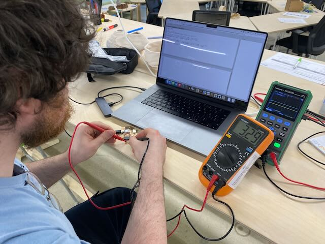
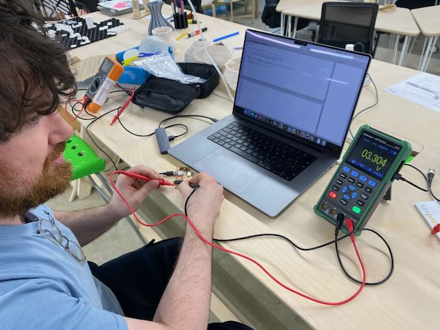
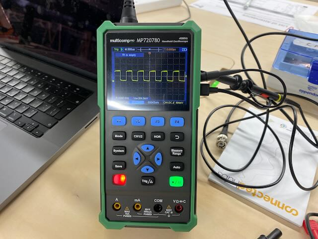
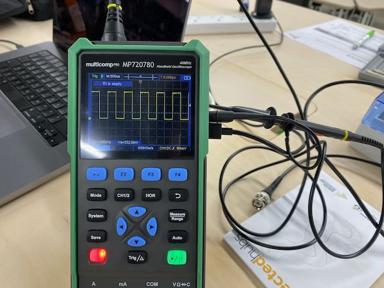
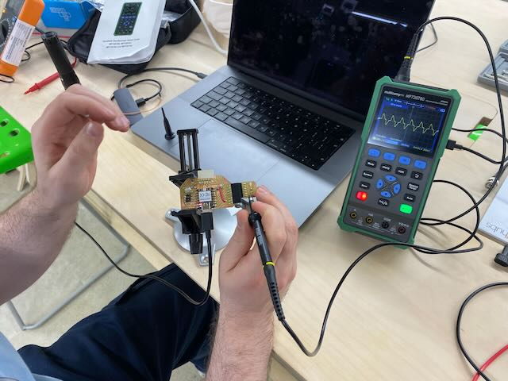

# Input devices

💡

Group assignment

* Probe an input device(s)'s analog levels and digital signals
* Document your work on the group work page and reflect on your individual page what you learned

***

### About this week 

> _Briefly describe the goal of the assignment. What are you characterizing, testing, or exploring_

Tested the photodiod using a multimeter

***

### Tools and materials used 

> _List all the machines, software and materials used in this assigment._

* RP2040 on a Xiao-Fab
* Photodiode module
* Multimeter
* Portable Oscilloscope

***

### Process and methodology 

> Describe step-by-step what the group did. Include sketches, screenshots, or videos if possible.

Type here

<figure><figcaption>
Tested a 
</figcaption></figure>

<figure><figcaption></figcaption></figure>

<figure><figcaption></figcaption></figure>

<figure><figcaption></figcaption></figure>

<figure><figcaption></figcaption></figure>

***

### Group conclusions 

> **Findings:** \[What did you learn from the process?]

> **Challenges:** \[What issues did you encounter?]

> **Solutions:** \[How did you solve them?]

Type here

***

### Files 

> Add all files created for this group assignment

See below link to to files created this week:
